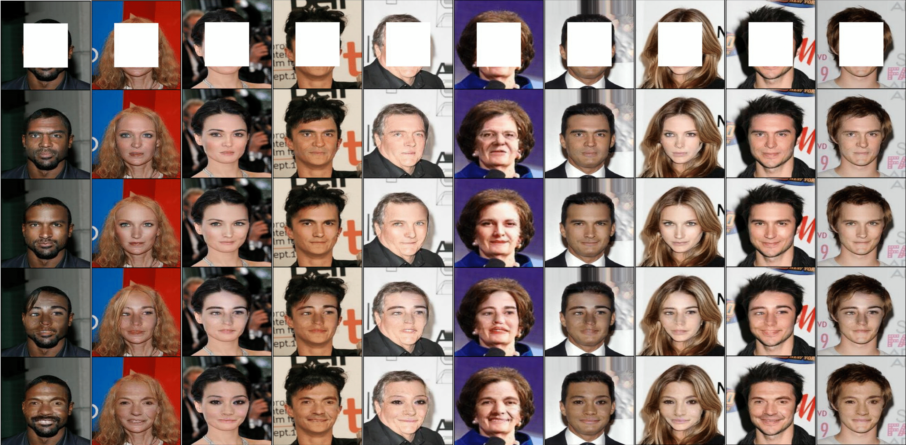

# Image Inpainting

This code is Pytorch implementation of image inpainting task in [Diversity-Sensitive Conditional Generative Adversarial Networks](https://openreview.net/forum?id=rJliMh09F7) in ICLR 2019 [[Project Page]](https://sites.google.com/view/iclr19-dsgan/) [[Paper]](https://arxiv.org/abs/1901.09024).



## Setup
* Set up conda environment
```
bash scripts/setup_env.sh [env_name] [cuda_version]
source activate [env_name]
```

* Download the [CelebA dataset](https://drive.google.com/open?id=0B7EVK8r0v71pZjFTYXZWM3FlRnM) and place it under the following directory.
```
└── data
    └── img_align_celeba
```

* You can optionally download the pre-trained model using the following script:
```
bash scripts/download_pretrained.sh
```

## Training
You can train your own model with following script
```
python train.py
```
Note that you can also specify gpu id, batch size and other training paramters via optional arguments. Please try ```python train.py --help``` for more information.

## Inference
You can run inference of your (or a pre-trained) model by following script
```
python test.py --exp_name [exp_name]
```
By default (e.g. using the pre-trained model for inference), you can run the inference by
```
python test.py --exp_name CENoise_noiseDim_32_lambda_5.000_outputDistperceptual_trans_ctr
```
