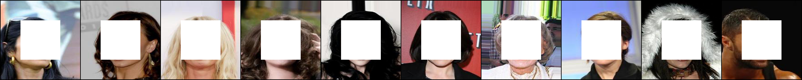

# Diversity-Sensitive Conditional GANs
Created by Dingdong Yang, [Seunghoon Hong](http://cvlab.postech.ac.kr/~maga33/), [Yunseok Jang](https://yunseokjang.github.io/), Tianchen Zhao, [Honglak Lee](http://web.eecs.umich.edu/~honglak/)

### [Paper](https://openreview.net/forum?id=rJliMh09F7) | [Project page](https://sites.google.com/corp/view/iclr19-dsgan/)

## Introduction
This repository contains the implementations of **[Diversity-Sensitive Conditional Generative Adversarial Networks (ICLR2019)](https://openreview.net/forum?id=rJliMh09F7)**, which proposes a simple regularization term that can be nicely plugged into any cGAN framework to promote diversity in the generator outputs.
```
@inproceedings{dsganICLR2019,
  title={Diversity-Sensitive Conditional Generative Adversarial Networks},
  author={Yang, Dingdong and Hong, Seunghoon and Jang, Yunseok and Zhao, Tianchen and Lee, Honglak},
  booktitle={Proceedings of the International Conference on Learning Representations},
  year={2019}
}
```

## Example Results
### [Image-to-Image Translation](https://github.com/maga33/DSGAN/tree/master/Image2ImageTranslation)


### [Image Inpainting](https://github.com/maga33/DSGAN/tree/master/Inpainting)



### [Video Prediction](https://github.com/maga33/DSGAN/tree/master/VideoPrediction)


