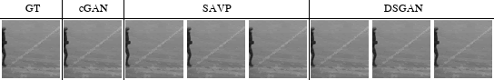
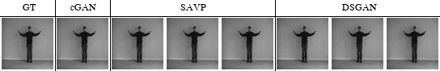
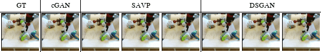
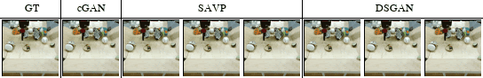

# Video Prediction

This code is about video prediction task of [Diversity-Sensitive Conditional Generative Adversarial Networks](https://openreview.net/forum?id=rJliMh09F7) in ICLR 2019 [[Project Page]](https://sites.google.com/view/iclr19-dsgan/) [[Paper]](https://arxiv.org/abs/1901.09024).
This repository is based on a baseline model called Stochastic Adversarial Video Prediction [[Paper]](https://arxiv.org/abs/1804.01523).

- [KTH Human Action Dataset](http://www.nada.kth.se/cvap/actions/)




- [BAIR Robot Pushing Dataset](https://sites.google.com/view/sna-visual-mpc/)





### Installation
- Setup Conda Environment via a script
```bash
bash scripts/setup_env.sh [env_name]
source activate [env_name]
```


### Download/Preprocess Dataset
- `bair`: [BAIR robot pushing dataset](https://sites.google.com/view/sna-visual-mpc/). [[Citation](data/bibtex/sna.txt)]
- `kth`: [KTH human actions dataset](http://www.nada.kth.se/cvap/actions/). [[Citation](data/bibtex/kth.txt)]

- Download and preprocess bair dataset:
```bash
bash data/download_and_preprocess_bair.sh
```

- Download and preprocess kth dataset:
```bash
bash data/download_and_preprocess_kth.sh
```

- You can also manually download the preprocessed data in here: [[BAIR]](https://drive.google.com/open?id=16DYyUKvT1qsdAxk0XyF89FvlSBqRHoO_), [[KTH]](https://drive.google.com/open?id=1esKKQUy619w2iJOD_V9JRpShO47aVuto)


### Training a Model
- You should first download the dataset

- Train a KTH model:
```bash
CUDA_VISIBLE_DEVICES=0 python scripts/train.py --input_dir data/kth --dataset kth \
  --model savp --model_hparams_dict hparams/kth/ours_gan/ours.json \
  --output_dir logs/kth
```
Note: model parameter needs to be fixed to savp (legacy from the original repo). encoder will not be selected via the hyperparameter file.

- To view training and validation information (e.g. loss plots, GIFs of predictions), run `tensorboard --logdir logs/ --port 6006` and open http://localhost:6006.

- For multi-GPU training, set `CUDA_VISIBLE_DEVICES` to a comma-separated list of devices, e.g. `CUDA_VISIBLE_DEVICES=0,1,2,3`. To use the CPU, set `CUDA_VISIBLE_DEVICES=""`.


### Evaluation
- BAIR:
```bash
bash scripts/evaluate_bair.sh
```

- KTH:
```bash
bash scripts/evaluate_kth.sh
```

- Each pretrained model is assumed to be at PROJECT_ROOT/logs/DATASET_NAME/ours_gan/. (e.g. logs/bair/ours_gan/HERE! )

- You can download our pre-trained model using the following script:
```bash
bash scripts/download_pretrained.sh
```

- You can also manually download our pretrained model in here: [[BAIR]](https://drive.google.com/open?id=1KauchMwKMM8Ot7zyADqXW7t0xKyDvTxv), [[KTH]](https://drive.google.com/open?id=15l3g9enRnfcxrD5ACAsM-RAdvN-21TuI).


### Model and Training Hyperparameters
The hyperparameters used in our experiments are provided in [`hparams`](hparams) as JSON files, and they can be passed onto the training script with the `--model_hparams_dict` flag.


## Citation

If you find this useful for your research, please use the following citation:
```
@inproceedings{yang-iclr19,
  title     = {{Diversity-Sensitive Conditional Generative Adversarial Networks}},
  author    = {Dingdong Yang and Seunghoon Hong and Yunseok Jang and Tiangchen Zhao and Honglak Lee},
  booktitle = {ICLR},
  year      = {2019},
}
```


Also, since our video prediction task is based on SAVP, please cite the original paper also:
```
@article{lee-arxiv18,
  title     = {{Stochastic Adversarial Video Prediction}},
  author    = {Alex X. Lee and Richard Zhang and Frederik Ebert and Pieter Abbeel and Chelsea Finn and Sergey Levine},
  journal   = {arXiv:1804.01523},
  year      = {2018}
}
```


